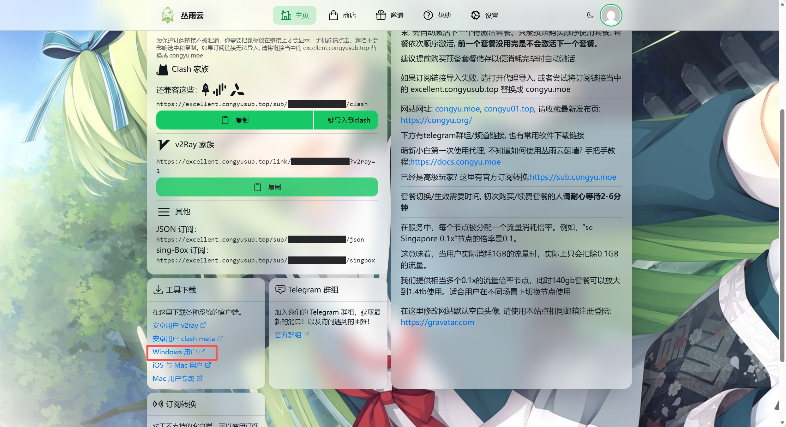
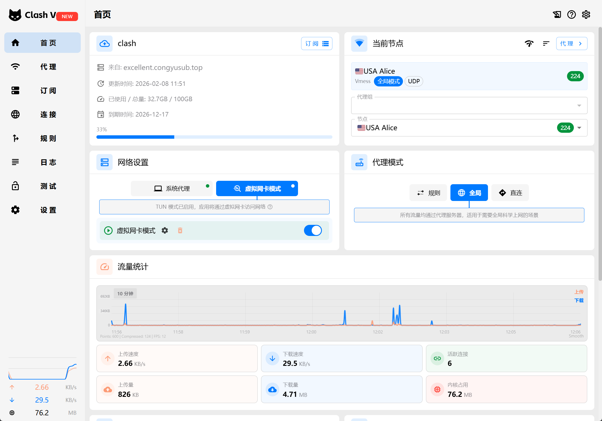
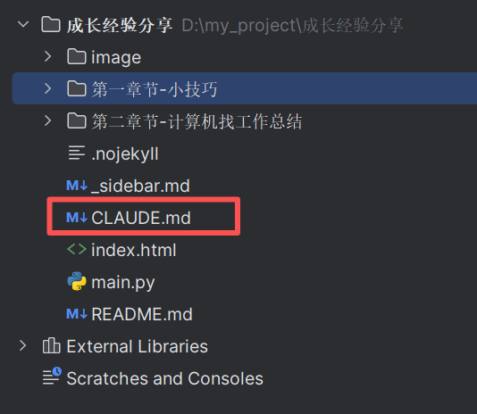

# Claude、ChatGPT怎么安装、使用

## 梯子
- 订阅梯子：https://congyu.moe/、https://xn--30rs3bu7r87f.com/#/plan/8
- 安装梯子

- 订阅的套餐导入
- 开启梯子

这个时候就可以访问了官网了，可以参考 **Claude、ChatGPT怎么不被封号** 这篇笔记，购买会员

## 安装claude code、codex
直接在命令行用就行，很方便的，习惯就好，没必要弄可视化界面
- 安装claude code：https://zhuanlan.zhihu.com/p/2013750250721014697
- 安装codex：https://blog.csdn.net/bynacqt/article/details/157184215

## 使用技巧
- 在当前目录下配置CLAUDE.md（claude）或者AGENTS.md（codex），每次运行前会先默认加载这个文件的内容 

- 配置，直接问AI配置文件在个目录，点进去修改即可，这样就不会每次修改文件前来问你，去掉这个烦人的步骤